# ДЗ-1 "Механизмы пространства имён"

> Задание: необходимо продемонстрировать изоляцию одного и того же приложения (как решено на семинаре - командного интерпретатора) в различных пространствах имен.

## Использование `chroot`

Меняем корневой каталог с помощью команды `chroot`:

`mkdir NewRoot`

`sudo chroot ./NewRoot/ /bin/bash`

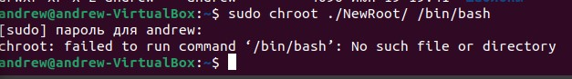

Получаем ошибку, потому что в новом корне не существует `bash`. 

С помощью команды `ldd` узнаём какие библиотеки нужны для `/bin/bash`:

`ldd /bin/bash`

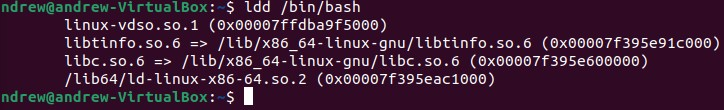

Создаём новые папки в NewRoot:

`mkdir NewRoot/bin`

`mkdir NewRoot/lib` 

`mkdir NewRoot/lib64`

Копируем файлы в соответствующие библиотеки в новый корень и заново выполняем `chroot`:

`cp /bin/bash NewRoot/bin/`

`cp /lib/x86_64-linux-gnu/libtinfo.so.6 NewRoot/lib/`

`cp /lib/x86_64-linux-gnu/libc.so.6 NewRoot/lib/`

`cp /lib64/ld-linux-x86-64.so.2 NewRoot/lib64/`

`sudo chroot ./NewRoot/ /bin/bash`

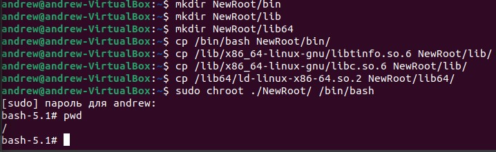

Если попытаться отобразить список файлов, получим ошибку:

`ls -l`

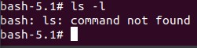

Чтобы заработало, нужно узнать где лежит ls:

`whereis ls`

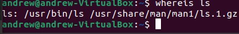

Создаём необходимые папки в новом корне и копируем туда файл программы, с помощью ldd узнаём необходимые библиотеки и копируем их в новый корень, повторяя всё то-же, что и для /bin/bash

---

## Namespases

Добавим сетевой namespace с помощью утилиты `ip netns`:

`sudo ip netns add ns1`

посмотрим:

`sudo ip netns list`

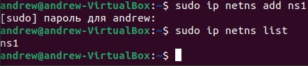

Запустим программу (bash) в новом пространстве имен:

`sudo ip netns exec ns1 bash`

посмотрим на список интерфейсов и обнаружим только loopback:

`ip a`

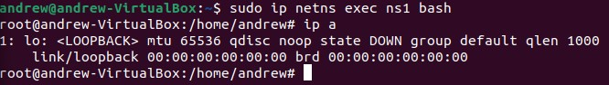

Следующей командой добавляем сетевой интерфейс и добавляем к нему peer:

`sudo ip link add veth0 type veth peer name veth1`

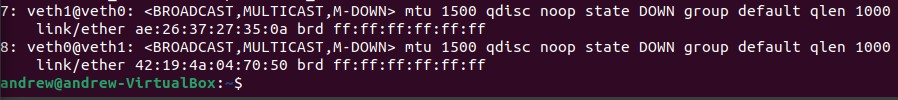

Теперь нужно перекинуть один из интерфейсов в новый ns1 и поднять интерфейсы:

`sudo ip link set veth1 netns ns1`

`ip a` в хостовой системе:

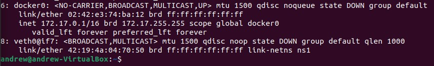

`ip a` в контейнере:

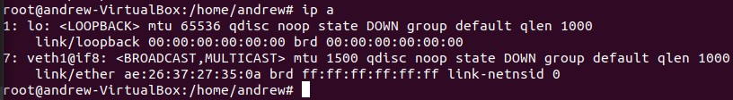

Теперь можем настроить сетевое взаимодействие. Присваиваем ip-адреса и поднимаем. Для хостового интерфейса:

`sudo ip addr add 10.0.0.1/24 dev veth0`

`sudo ip link set dev veth0 up`

И то-же самое для контейнера:

`sudo ip addr add 10.0.0.2/24 dev veth1`

`sudo ip link set dev veth1 up`

Выполняем команду `ip a` для контейнера и хостовой машины и убеждаемся, что интерфейсам veth1 и veth0 присвоены ip-адреса и они в состоянии UP:

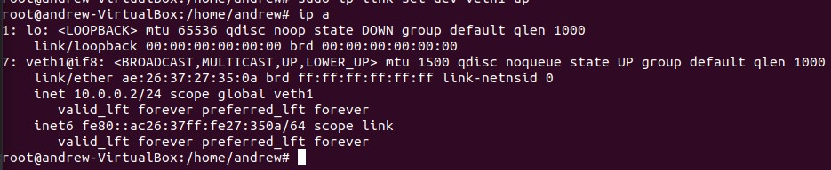

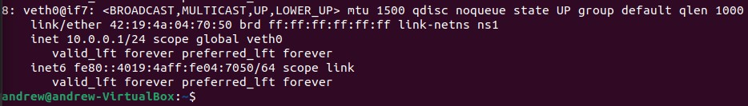

Пингуем из хостовой в контейнер:

`ping 10.0.0.2`

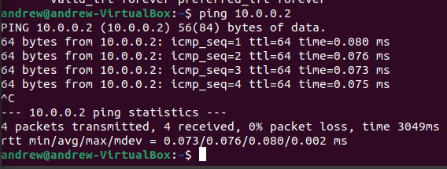

Пингуем из контейнера в хостовую:

`ping 10.0.0.1`

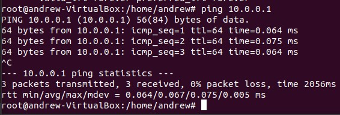

---

## unshare
>Запускает программу в новом пространстве имён.

Войдем в папку ns текущего ($$) процесса, в которой хранятся его namespases :

`cd /proc/$$/ns`

`ll -l`

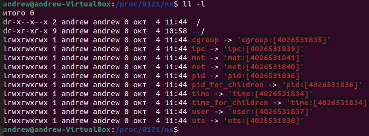

Запускаем дочерний процесс с ограничениями, накладываемые утилитой `unshare` и сравниваем PID:

`sudo upshare --pid --net --fork --mount-proc bash`

`ls -l /proc/$$/ns`

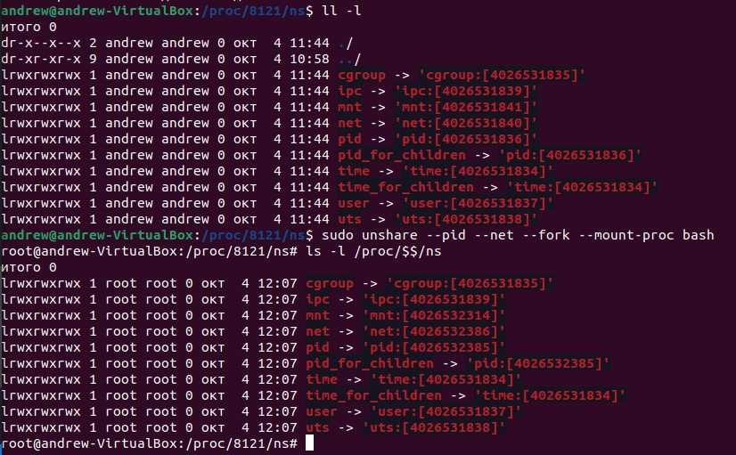

