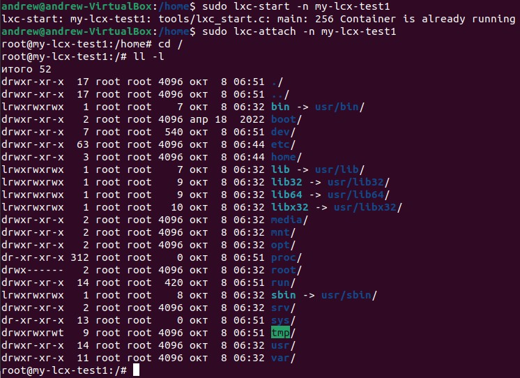
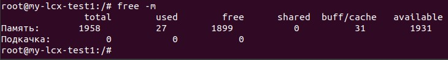
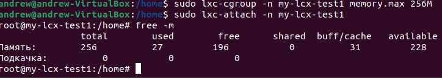
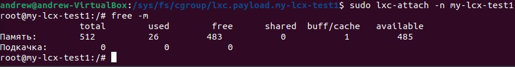
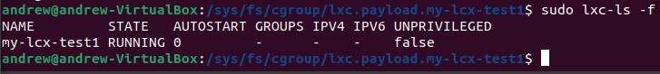
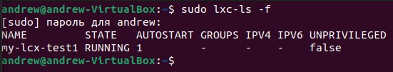

# ДЗ-2: "Механизмы контрольных групп."

> Задание 1:
>1. запустить контейнер с ubuntu, используя механизм LXC
>2. ограничить контейнер 256 Мб ОЗУ и проверить, что ограничение работает
>3. добавить автозапуск контейнеру, перезагрузить ОС и убедиться, что контейнер действительно запустился самостоятельно
>4. при создании указать файл, куда записывать логи
>5. после перезагрузки проанализировать логи

Устанавливаем LXC утилиты:

`sudo apt-get install lxc debootstrap bridge-utils lxc-templates`

Создаём контейнер:

`sudo lxc-create -n my-lcx-test1 -t ubuntu `

Запускаем контейнер:

`sudo lxc-start -n my-lcx-test1 `

Подключаемся к контейнеру:

`sudo lxc-attach -n my-lcx-test1`

`cd /`

`ll -l`

Проверим количество памяти, доступной контейнеру:

`free -m`

Выходим из контейнера и ставим ограничение с помощью утилиты `cgroup`:

`exit`

`sudo lxc-cgroup -n my-lcx-test1 memory.max 256`

Подключаемся к контейнеру и смотрим память:

`sudo lxc-attach -n my-lcx-test1`

`free -m`

Вносим изменения в файл:

`sudo nano /var/lib/lxc/my-lcx-test1/config`

Добавляем строку:

`lxc.cgroup2.memory.max = 512M`

Останавливаем и перезапускаем контейнер:

`sudo lxc-stop -n my-lcx-test1`

`sudo lxc-start -n my-lcx-test1`

`sudo-attach -n my-lcx-test1`

`free -m`

Для автоматической загрузки добавляем в конфигурационный файл строку:

`lxc.start.auto = 1`

Смотрим состояние контейнера:

`sudo lxc-ls -f`

Перезагружаем систему:

`reboot`

Смотрим состояние контейнера:

`sudo lxc-ls -f`

Чтобы вывести информацию в лог файл запускаем контейнер коммандой:

`sudo lxc-start -n my-lcx-test1 --logfile log.log`

Удаляем контейнер:

`sudo lxc-destroy -n my-lcx-test1`

---

`lxc-start con2 --logfile=HomeWork02/con2.log --logpriority=NOTICE `
запустить контейнер с именем con2, назначить лог-файл, назначить уровень логирования 

`lxc-start con1 --logfile=HomeWork02/con1.log --logpriority=NOTICE`
запустить контейнер с именем con1, назначить лог-файл, назначить уровень логирования

На этом этапе оба контейнера подключились в общую сеть на мост lxcbr0. Был отключен dhcp в файлах /etc/netplan/0-lxc.yaml, соответственно, сеть работать перестала.
Далее хост-система была перезагружена, контейнеры запустились автоматически, без сети, с заданными ограничениями памяти.
Изменений в назначенных лог-файлах не возникло. Запись в лог-файлы после перезагрузки стала осуществляться после добавления опций логирования в конфигурационные файлы контейнеров.

После этого постепенно была настроена сеть средствами утилиты ip. 
Затем были изменены файлы конфигурации netplan контейнеров и хост-системы.
Общий результат: 
Контейнеры запускаются автоматически, пингуютдруг-друга и хост-систему. Доступа в интернет из контейнеров нет. Логирование настроено на уровень DEBUG, с сохранением в файл на хост-системе.

Содержимое конфигурационного файла netplan контейнера con1:

 `cat /var/lib/lxc/con1/rootfs/etc/netplan/10-lxc.yaml `

network:

  version: 2

  renderer: networkd

  ethernets:

    eth0: 
      dhcp4: no
      addresses: [ 10.0.11.2/24 ]
      routes:
      - to: default
        via: 10.0.11.2
      - to: 10.0.11.0/24
        via: 10.0.11.2
- to: 10.0.12.0/24

via: 10.0.11.1

Содержимое конфигурационного файла netplan хост-системы:

 `cat /etc/netplan/00-installer-config.yaml` 

 This is the network config written by 'subiquity'
network:

  version: 2

  renderer: networkd

  ethernets:

    enp0s3:
      dhcp4: true

  bridges:

    lxcbr1:
      dhcp4: false
      addresses: [ 10.0.11.1/24 ]
      routes:
      - to: 10.0.11.0/24
        via: 10.0.11.1
        on-link: true
    lxcbr2:
      dhcp4: false
      addresses: [ 10.0.12.1/24 ]
      routes:
      - to: 10.0.12.0/24

via: 10.0.12.1

on-link: true

