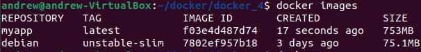
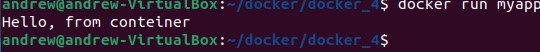

# ДЗ-4: Dockerfile и слои.

> Задание: необходимо создать Dockerfile, основанный на любом образе (вы в праве выбрать самостоятельно).
В него необходимо поместить приложение, написанное на любом известном вам языке программирования (Python, Java, C, С#, C++).
При запуске контейнера должно запускаться самостоятельно написанное приложение.

В рабочей папке создаём файл `Program.java`:

```
public class Program {
    public static void main(String [] args) {

        System.out.println("Hello, from conteiner");
    }
}

```
В этой же папке создаём файл `Dockerfile`:

```
FROM debian:unstable-slim
RUN apt update && apt install openjdk-20-jdk -y
WORKDIR /home/andrew/docker/docker_4
COPY Program.java .
RUN javac Program.java
CMD ["java", "Program"]
```

Создаём контейнер:

```
docker build -t myapp .
docker images
```



Запускаем контейнер:

`docker run myapp`



Очищаем систему:

`docker system prune -af`