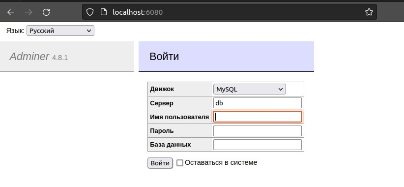

# ДЗ-5: Docker Compose и Docker Swarm.

> Задание 1:
> 1. создать docker compose файл, состоящий из 2 различных контейнеров: 1 - веб, - БД
> 2. запустить docker compose файл
> 3. по итогу на БД контейнере должно быть 2 реплики, на админере должна быть 1 реплика. Всего должно получиться 3 контейнера
> 4. выводы зафиксировать

_Создаём файл_ `docker-compose.yaml`:
```
version: '3.9'

services:

  db:
    image: mariadb:10.10.2
    environment:
      MYSQL_ROOT_PASSWORD: 1234
    restart: unless-stoped
    volumes:
      - db:/var/lib/mysql
    networks:
      - app-network
    deploy:
      mode: replicated
      replicas: 2

  adminer:
    image: adminer:4.8.1
    restart: always
    ports:
      - 6080:8080
    networks:
      - app-networkвщслук
    deploy:
      mode: replicated
      replicas: 1

volumes:
  db:

networks:
  app-network:
    driver: bridge
```

_Выполняем:_

`docker compose up`

_Смотрим список запущенных контейнеров:_

`docker ps`


_В поисковой строке браузера вводим:_

`localhost:6080`



_Входим как `root` с паролем `1234`:_


_Завершаем работу:_

```
docker-compose down

docker system prune -af
```