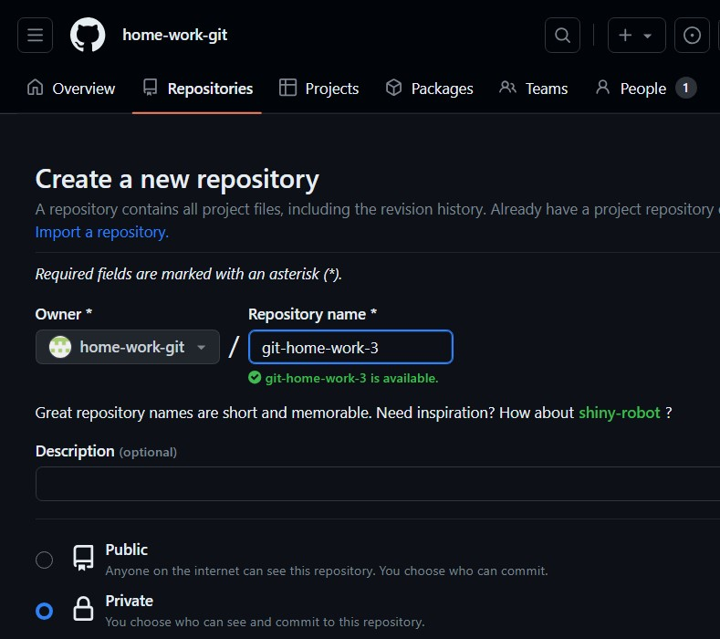
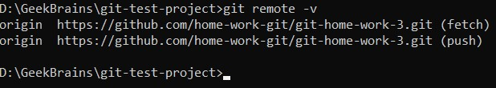
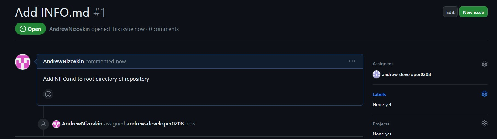
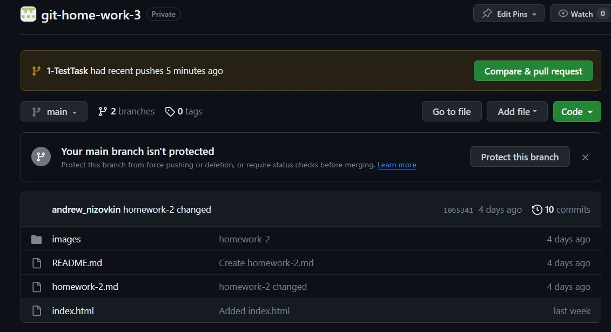
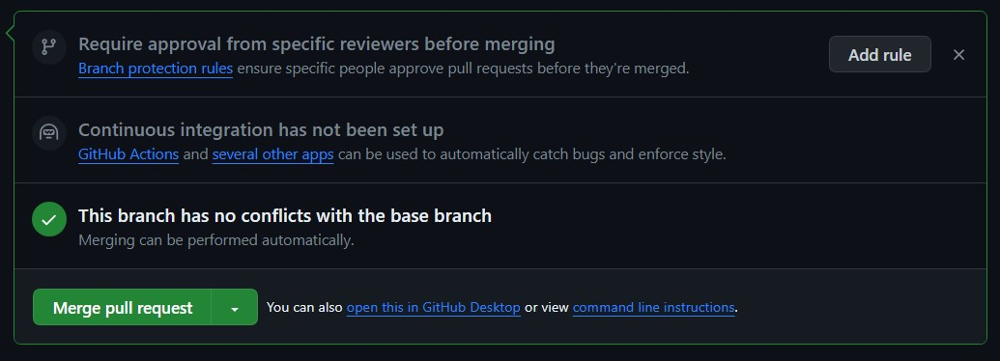
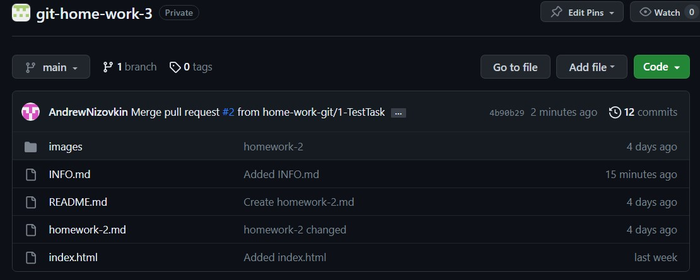

# Урок 3. Практики и инструменты для работы с Git

> 1. Пригласите в свой проект кого-то из коллег по обучению, дайте им доступ к своему репозиторию (кроме ветки master).
>
> 2. Поставьте ему в GitHub задачу по своему проекту, попросите её выполнить в отдельной ветке, а после выполнения — создать pull request и перевести задачу обратно на вас.
>
>3. Проверьте выполнение задачи, примите pull request и удалите ветку, в которой решалась данная задача.

_Заходим на github.com и создаём новую организацию и новый репозиторий:_


_В разделе "Peoples" добавляем разработчика (invite member):_

_Перепривязываем локальный репозиторий к вновь созданному:_

```
git remote remove origin

git remote add origin https://github.com/home-work-git/git-home-work-3.git

git remote -v
```


_Отправляем содержимое локального репозитория на удалённый:_

```
git push -u origin master 
```

_Разработчик принимает инвайт, клонирует репозиторий_

_В репозитории организации добавляем разработчика в разделе "Collaborators and teams". Создаём задачу и связываем её с разработчиком_



_Разработчик принимает задачу. В своём репозитории создаёт новую ветку:_

```
git checkout -b 1-TestTask
```

_Разработчик, находясь в локальном репозитории и новой ветке выполняет поставленную задачу, добавляет изменения в индекс, делает коммит и пушит ветку в удалённый репозиторий:_

```
git push -u origin 1-TestTask
```



_Администратор организации просматривает работу и, делает merge pull request:_



_После успешного слияния администратор удаляет ветку 1-TestTask_

