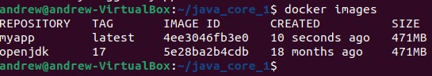
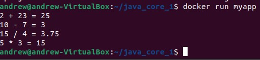

## Урок 1. Компиляция и интерпретация кода.

> Создать проект из трёх классов (основной с точкой входа и два класса в другом пакете), которые вместе должны составлять одну программу, позволяющую производить четыре основных математических действия и осуществлять форматированный вывод результатов пользователю (ИЛИ ЛЮБОЕ ДРУГОЕ ПРИЛОЖЕНИЕ НА ВАШ ВЫБОР, которое просто демонстрирует работу некоторого механизма). 
>
> Создать Dockerfile, позволяющий откопировать исходный код вашего приложения в образ для демонстрации работы вашего приложения при создании соответствующего контейнера.

_В корневой папке проекта создаём Dockerfile и пишем в него:_

```docker
FROM openjdk:17
COPY ./src/ ./src/
RUN mkdir ./out
RUN javac -sourcepath ./src -d out src/Main.java
CMD ["java", "-classpath", "./out", "Main"] 

```
_В командной строке выполняем:_

```bash
docker build -t myapp .
docker images
```



_Запускаем приложение:_

```bash
docker run myapp
```


