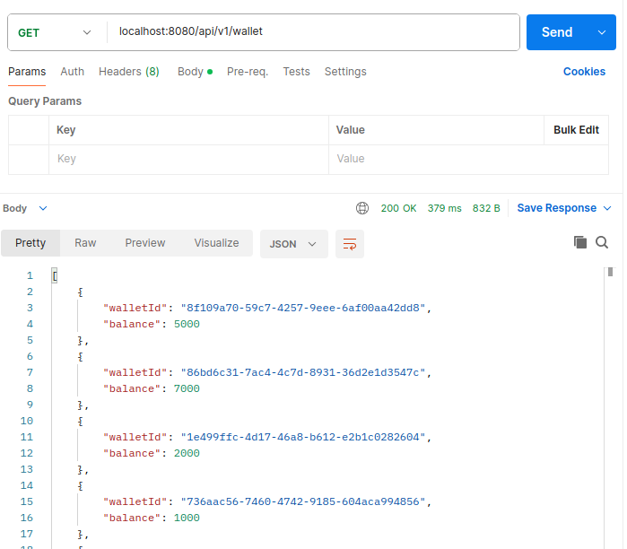
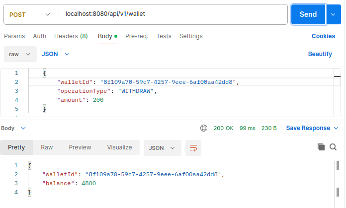
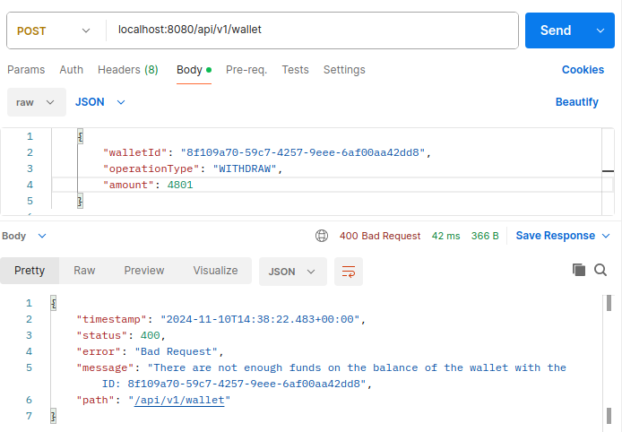
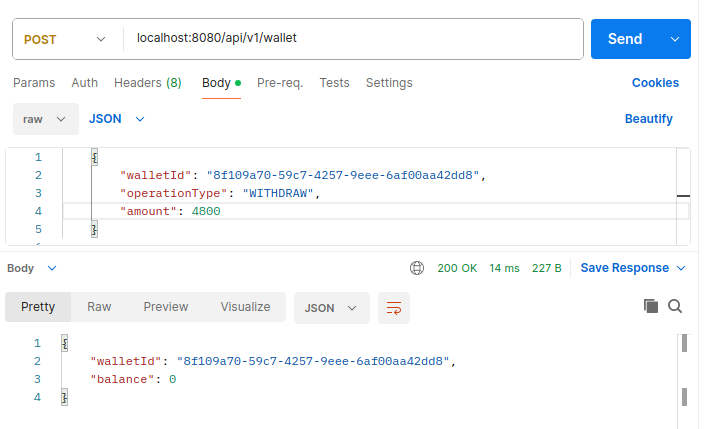
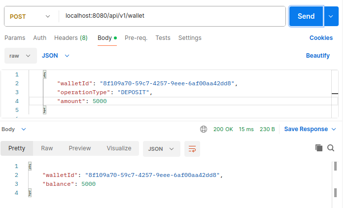
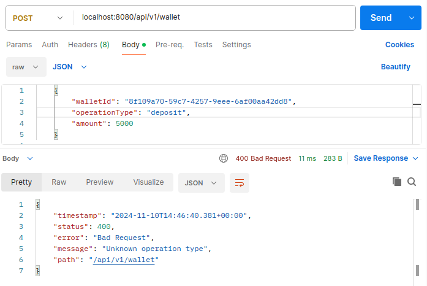
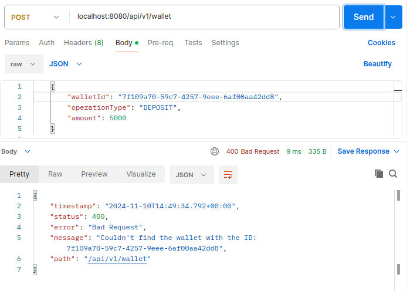
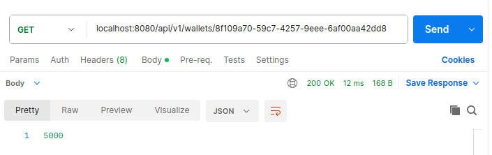
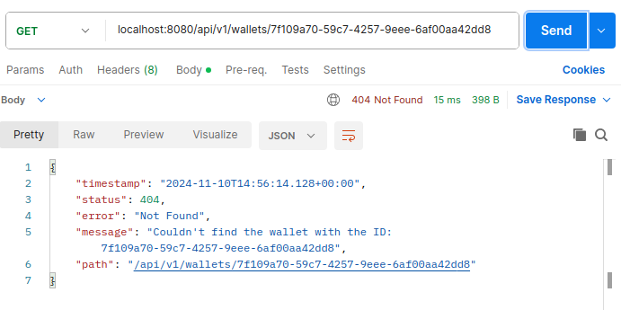
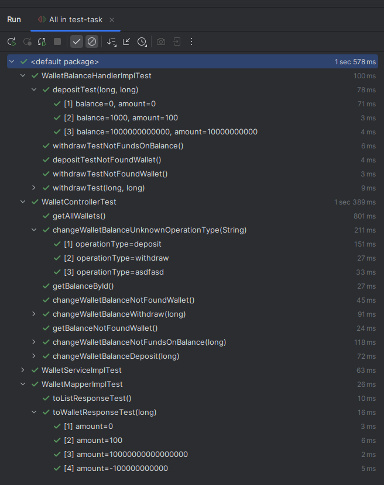

## Ручное тестирование с помощью Postman

Поднимем базу данных и приложение на localhost:8080 и протестируем наши эндпоинты:

### Получить все записи:

### Вывести сумму с баланса кошелька, меньшую, чем баланс:

### Вывести сумму, превышающую баланс кошелька

### Вывести все деньги с баланса

### Внести депозит на баланс кошелька

### Выполнить запрос с некорректным значением `operationType`

### Выполнить запрос на изменение кошелька при отсутсвии такого в бд

### Получить баланс кошелька с указанным ID

### Выполнить запрос на получение баланса кошелька, не существующего в бд

### Результаты тестов приложения

