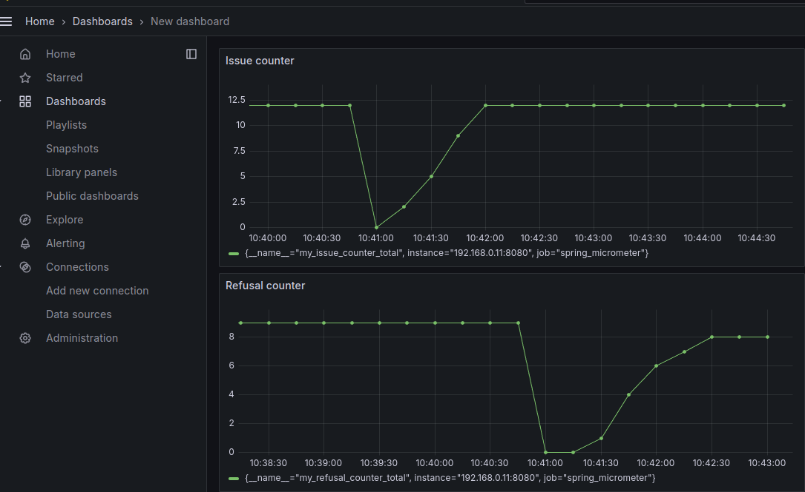

## Урок 11. Spring Actuator. Настройка мониторинга с Prometheus и Grafana.

Повторить проект с семинара.

Развернуть Actuator в Spring приложении и настроить предоставление данных для прометеуса.

Добавить метрики в актуатор:

1. Количество выданных книг

2. Количество отказов (переданны id несуществующих ресурсов или превышен лимит книг у читателя)

Развернуть Prometheus и настроить его слушать данные от спринг приложения.

Развернуть Grafana и настроить его на построение графиков по данным прометеуса. 

Создать DashBoard для отображения кастомных метрик.

Сделать скриншот графиков из Grafana и прислать в качестве решения домашнего задания

